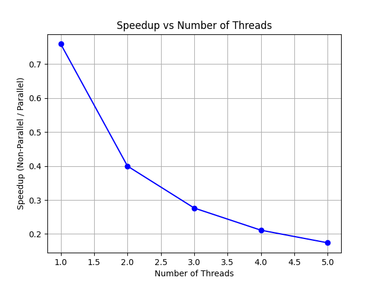

# Floyd-Warshall Algorithm Implementation with Parallelization

## Table of Contents
- [Floyd-Warshall Algorithm Implementation with Parallelization](#floyd-warshall-algorithm-implementation-with-parallelization)
  - [Table of Contents](#table-of-contents)
  - [Overview](#overview)
  - [Features](#features)
  - [Prerequisites](#prerequisites)
  - [Installation](#installation)
  - [Usage](#usage)
  - [Output](#output)
  - [Performance Notes](#performance-notes)
  - [License](#license)

## Overview

This project implements the **Floyd-Warshall algorithm** to compute the shortest paths between all pairs of nodes in a graph. It provides both a **simple (sequential)** and a **parallel** implementation using Python's threading capabilities. The program generates a random graph based on specified parameters, executes both versions of the algorithm, measures their execution times, calculates speedups achieved through parallelization, and visualizes the results.

## Features

- **Graph Generation**: Create random graphs with a specified number of nodes and edge connection probability.
- **Floyd-Warshall Implementations**:
  - **Simple (Sequential)**: Standard implementation of the Floyd-Warshall algorithm.
  - **Parallel**: Attempts to parallelize the algorithm using multiple threads.
- **Performance Measurement**: Measures and compares execution times of both implementations.
- **Speedup Analysis**: Calculates the speedup achieved by parallelization across different thread counts.
- **Visualization**: Generates a plot illustrating the relationship between the number of threads and the achieved speedup.

## Prerequisites

- Python 3.6 or higher
- Required Python libraries:
  - `numpy`
  - `matplotlib`

## Installation

1. **Clone the Repository**

   ```bash
   git clone https://github.com/abubakar61170/floyd-warshall-parallel.git
   cd floyd-warshall-parallel
   ```

2. **Create a Virtual Environment (Optional but Recommended)**

   ```bash
   python3 -m venv venv
   source venv/bin/activate  # On Windows: venv\Scripts\activate
   ```

3. **Install Dependencies**

   ```bash
   pip install numpy matplotlib
   ```

## Usage

1. **Run the Script**

   Execute the Python script using the following command:

   ```bash
   python main.py
   ```

2. **Customize Parameters**

   You can modify the number of nodes and the edge connection probability by editing the `main()` function in the script:

   ```python
   def main():
       nodes = 100          # Number of nodes in the graph
       probability = 0.5    # Probability of edge creation between nodes
       ...
   ```

   Adjust `nodes` and `probability` as needed to generate different graph sizes and densities.

## Output

Upon running the script, the following outputs are generated:

1. **Console Output**

   - **Graph Information**: Displays the number of nodes and the connection probability.
   - **Execution Times**: Shows the execution time for the non-parallel (simple) implementation.
   - **Speedup Results**: Lists the speedup achieved for each number of threads used in the parallel implementation.

   **Example:**
   ```
   Graph generated with 100 nodes and ~50.0% connection probability.
   Non-Parallel Execution Time: 2.50 seconds
   Threads: 1 Speedup: 1.00
   Threads: 2 Speedup: 1.20
   ...
   
   Speedup Results:
   Threads: 1, Speedup: 1.00
   Threads: 2, Speedup: 1.20
   ...
   ```

2. **Plot**

   - **Speedup vs. Number of Threads**: A plot (`speedup_threads.png`) is saved and displayed, illustrating how the speedup varies with the number of threads used in the parallel implementation.

   

## Performance Notes

- **Global Interpreter Lock (GIL)**: Python's GIL can limit the performance gains from threading, especially for CPU-bound tasks like the Floyd-Warshall algorithm. As a result, the parallel implementation may not achieve significant speedups and could sometimes be slower than the simple implementation.
  
- **Thread Management**: The current parallel approach spawns multiple threads for each iteration `k` in the algorithm, which may lead to excessive context switching and overhead. For improved performance, consider alternative parallelization strategies or using multiprocessing instead of threading.

- **Scalability**: This implementation is suitable for educational purposes and small to medium-sized graphs. For larger graphs or performance-critical applications, optimized libraries or implementations in lower-level languages may be preferable.

## License

This project is licensed under the [MIT License](LICENSE).

---

*Feel free to contribute, report issues, or suggest improvements by opening an issue or a pull request on the [GitHub repository](https://github.com/abubakar61170/floyd-warshall-parallel).*
